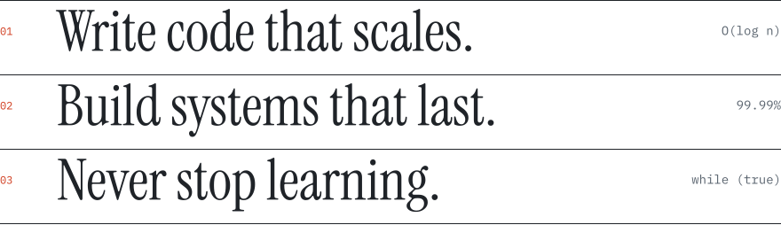

<picture>
  <source media="(prefers-color-scheme: dark)" srcset="assets/hero-dark.svg">
  
</picture>

I build backend systems that hold their shape under load: services and APIs designed to scale, distributed where they need to be, and fast because the hot paths were measured. These days the problems I find most interesting sit where that work meets AI.

### What I work on

<dl>
  <dt>Backend architecture</dt>
  <dd>High-performance, scalable services and APIs. Distributed systems, system design, and performance optimization.</dd>
  <dt>Full-stack web</dt>
  <dd>Web applications built end to end, from the data model to the interface.</dd>
  <dt>Data and machine learning</dt>
  <dd>Data pipelines and analysis, and machine and deep learning models applied to real-world problems.</dd>
</dl>

### Still streaming

LLM integration, retrieval-augmented generation and AI agents, and what they change about the way software gets built.

 

<picture>
  <source media="(prefers-color-scheme: dark)" srcset="assets/principles-dark.svg">
  
</picture>

May the force be with you.
